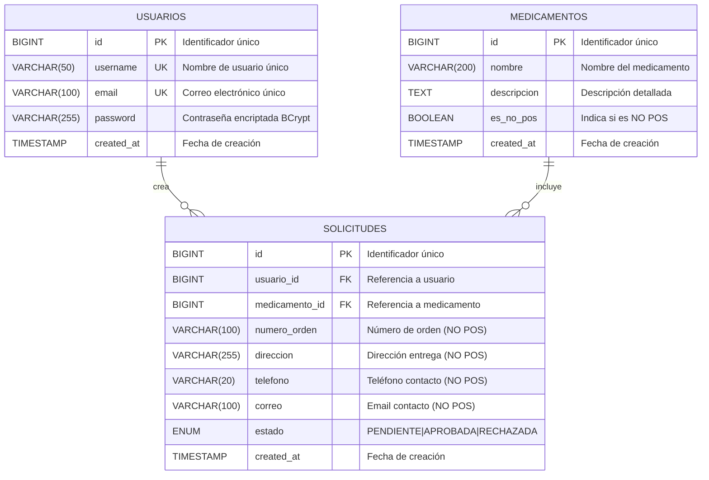
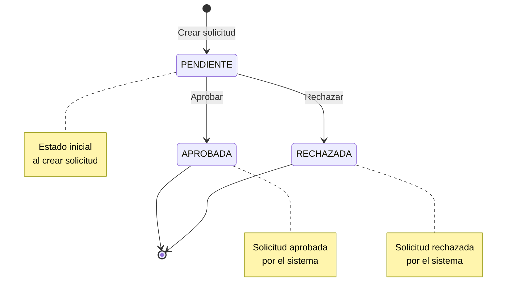
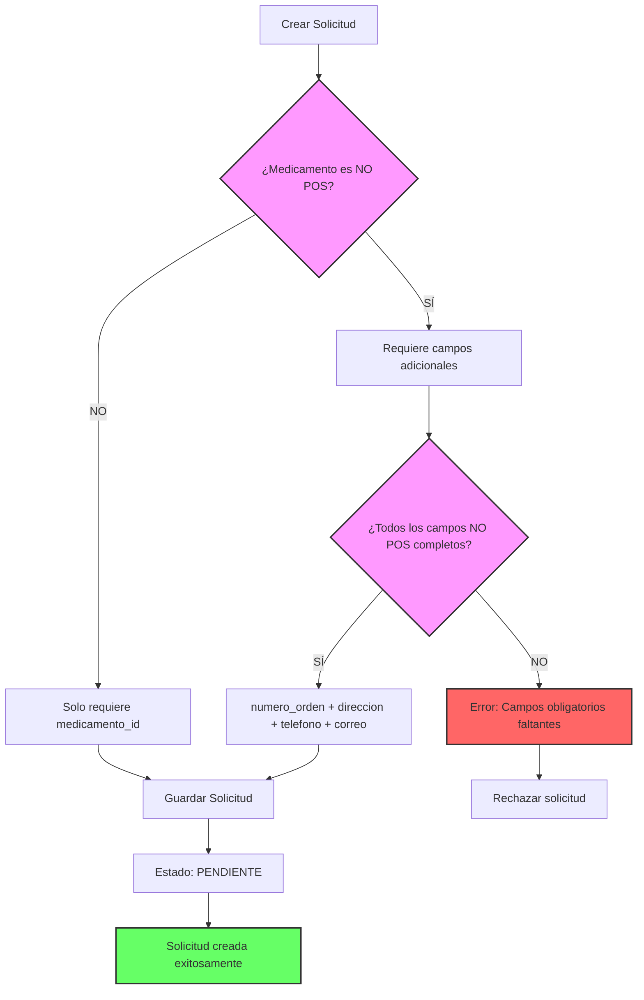

# Base de Datos MySQL - Sistema de Medicamentos

Este directorio contiene la configuración de Docker Compose para la base de datos MySQL del sistema de gestión de medicamentos.

## 📋 Archivos

- **docker-compose.yml**: Configuración de Docker Compose para MySQL
- **schema.sql**: Script de creación de tablas y estructura de la base de datos
- **seed.sql**: Script de datos iniciales (medicamentos, usuarios de prueba, solicitudes de ejemplo)

## 🚀 Inicio Rápido

### Iniciar la base de datos

```bash
cd database
docker compose up -d
```

Este comando:
1. Descarga la imagen de MySQL 8.0 (si no existe)
2. Crea el contenedor `medicamentos-mysql`
3. Crea automáticamente la base de datos `medicamentos_db`
4. Ejecuta `schema.sql` para crear las tablas
5. Ejecuta `seed.sql` para cargar los datos iniciales

### Verificar el estado

```bash
docker compose ps
```

### Ver logs

```bash
docker compose logs -f mysql
```

### Detener la base de datos

```bash
docker compose down
```

### Detener y eliminar datos

```bash
docker compose down -v
```

## 🔧 Configuración

### Credenciales de MySQL

- **Host**: localhost
- **Puerto**: 3306
- **Base de datos**: medicamentos_db
- **Usuario root**: root / root
- **Usuario aplicación**: medicamentos_user / medicamentos_pass

### Conexión desde la aplicación

Actualiza el archivo `application.yml` del backend:

```yaml
spring:
  datasource:
    url: jdbc:mysql://localhost:3306/medicamentos_db?createDatabaseIfNotExist=true&useSSL=false&serverTimezone=UTC
    username: root
    password: root
```

O usa el usuario de aplicación:

```yaml
spring:
  datasource:
    url: jdbc:mysql://localhost:3306/medicamentos_db?useSSL=false&serverTimezone=UTC
    username: medicamentos_user
    password: medicamentos_pass
```

## 📊 Datos Iniciales

El archivo `seed.sql` incluye:

### Medicamentos POS (43)
- Analgésicos y Antipiréticos
- Antiinflamatorios
- Antibióticos
- Antihipertensivos
- Antidiabéticos
- Gastrointestinales
- Cardiovasculares
- Respiratorios
- Vitaminas y Suplementos
- Otros (ansiolíticos, antidepresivos, hormonas)

### Medicamentos NO POS (34)
- Biológicos para enfermedades autoinmunes
- Oncológicos
- Antivirales de alto costo
- Enfermedades raras
- Esclerosis múltiple
- Hemofilia
- Hormonas de crecimiento
- Inmunosupresores
- Oftalmológicos de alto costo

### Usuarios de Prueba

El sistema incluye dos usuarios de prueba pre-configurados:

| Username | Email | Password |
|----------|-------|----------|
| admin | admin@medicamentos.com | password123 |
| usuario1 | usuario1@example.com | password123 |

**Nota**: El sistema permite el **registro de nuevos usuarios** a través del frontend (http://localhost:4200/register). Los usuarios registrados pueden iniciar sesión inmediatamente y gestionar sus propias solicitudes de medicamentos.

### Solicitudes de Ejemplo

Se incluyen solicitudes de ejemplo tanto para medicamentos POS como NO POS.

## 🔄 Recargar Datos

Si necesitas recargar los datos:

```bash
# Detener y eliminar el contenedor y volumen
docker compose down -v

# Iniciar nuevamente (ejecutará schema.sql y seed.sql)
docker compose up -d
```

## 🛠️ Comandos Útiles

### Conectarse a MySQL desde el contenedor

```bash
docker compose exec mysql mysql -u root -proot medicamentos_db
```

### Ejecutar un script SQL

```bash
docker compose exec -T mysql mysql -u root -proot medicamentos_db < mi_script.sql
```

### Backup de la base de datos

```bash
docker compose exec mysql mysqldump -u root -proot medicamentos_db > backup.sql
```

### Restaurar backup

```bash
docker compose exec -T mysql mysql -u root -proot medicamentos_db < backup.sql
```

## 🏥 Estructura de Tablas

### usuarios
- id (BIGINT, PK)
- username (VARCHAR(50), UNIQUE)
- email (VARCHAR(100), UNIQUE)
- password (VARCHAR(255))
- created_at (TIMESTAMP)

### medicamentos
- id (BIGINT, PK)
- nombre (VARCHAR(200))
- descripcion (TEXT)
- es_no_pos (BOOLEAN)
- created_at (TIMESTAMP)

### solicitudes
- id (BIGINT, PK)
- usuario_id (BIGINT, FK)
- medicamento_id (BIGINT, FK)
- numero_orden (VARCHAR(100)) - Solo para NO POS
- direccion (VARCHAR(255)) - Solo para NO POS
- telefono (VARCHAR(20)) - Solo para NO POS
- correo (VARCHAR(100)) - Solo para NO POS
- estado (ENUM: PENDIENTE, APROBADA, RECHAZADA)
- created_at (TIMESTAMP)

## � Diagrama Entidad-Relación

### Diagrama Visual (ASCII)

```
┌─────────────────────────────────────────────────────────────┐
│                         USUARIOS                            │
├─────────────────────────────────────────────────────────────┤
│ PK │ id                BIGINT                               │
│    │ username          VARCHAR(50)    UNIQUE, NOT NULL      │
│    │ email             VARCHAR(100)   UNIQUE, NOT NULL      │
│    │ password          VARCHAR(255)   NOT NULL              │
│    │ created_at        TIMESTAMP      DEFAULT CURRENT       │
└─────────────────────────────────────────────────────────────┘
                            │
                            │ 1
                            │
                            │ N
                            ▼
┌─────────────────────────────────────────────────────────────┐
│                       SOLICITUDES                           │
├─────────────────────────────────────────────────────────────┤
│ PK │ id                BIGINT                               │
│ FK │ usuario_id        BIGINT         NOT NULL              │
│ FK │ medicamento_id    BIGINT         NOT NULL              │
│    │ numero_orden      VARCHAR(100)   NULL                  │
│    │ direccion         VARCHAR(255)   NULL                  │
│    │ telefono          VARCHAR(20)    NULL                  │
│    │ correo            VARCHAR(100)   NULL                  │
│    │ estado            ENUM           DEFAULT 'PENDIENTE'   │
│    │                   (PENDIENTE, APROBADA, RECHAZADA)     │
│    │ created_at        TIMESTAMP      DEFAULT CURRENT       │
└─────────────────────────────────────────────────────────────┘
                            │
                            │ N
                            │
                            │ 1
                            ▼
┌─────────────────────────────────────────────────────────────┐
│                      MEDICAMENTOS                           │
├─────────────────────────────────────────────────────────────┤
│ PK │ id                BIGINT                               │
│    │ nombre            VARCHAR(200)   NOT NULL              │
│    │ descripcion       TEXT           NULL                  │
│    │ es_no_pos         BOOLEAN        DEFAULT FALSE         │
│    │ created_at        TIMESTAMP      DEFAULT CURRENT       │
└─────────────────────────────────────────────────────────────┘
```

### Diagrama Mermaid



### Relaciones

#### 1. USUARIOS → SOLICITUDES (1:N)
- **Tipo**: Uno a Muchos
- **Descripción**: Un usuario puede crear múltiples solicitudes
- **Cardinalidad**: 1 usuario → N solicitudes
- **Clave Foránea**: `solicitudes.usuario_id` → `usuarios.id`
- **Acción en Cascada**: `ON DELETE CASCADE`

#### 2. MEDICAMENTOS → SOLICITUDES (1:N)
- **Tipo**: Uno a Muchos
- **Descripción**: Un medicamento puede estar en múltiples solicitudes
- **Cardinalidad**: 1 medicamento → N solicitudes
- **Clave Foránea**: `solicitudes.medicamento_id` → `medicamentos.id`
- **Acción en Cascada**: `ON DELETE CASCADE`

### Índices

#### Tabla: usuarios
- `PRIMARY KEY (id)`
- `UNIQUE INDEX idx_username (username)`
- `UNIQUE INDEX idx_email (email)`

#### Tabla: medicamentos
- `PRIMARY KEY (id)`
- `INDEX idx_nombre (nombre)`
- `INDEX idx_es_no_pos (es_no_pos)`

#### Tabla: solicitudes
- `PRIMARY KEY (id)`
- `FOREIGN KEY (usuario_id) REFERENCES usuarios(id)`
- `FOREIGN KEY (medicamento_id) REFERENCES medicamentos(id)`
- `INDEX idx_usuario_id (usuario_id)`
- `INDEX idx_medicamento_id (medicamento_id)`
- `INDEX idx_estado (estado)`
- `INDEX idx_created_at (created_at)`

### Reglas de Negocio

#### Validaciones a Nivel de Base de Datos

1. **Usuarios**
   - `username` y `email` deben ser únicos
   - Todos los campos son obligatorios excepto `created_at`

2. **Medicamentos**
   - `nombre` es obligatorio
   - `es_no_pos` tiene valor por defecto `FALSE`

3. **Solicitudes**
   - `usuario_id` y `medicamento_id` son obligatorios
   - Campos `numero_orden`, `direccion`, `telefono`, `correo` son opcionales
   - `estado` tiene valor por defecto `PENDIENTE`

#### Validaciones a Nivel de Aplicación

1. **Medicamentos NO POS**
   - Si `medicamentos.es_no_pos = TRUE`, entonces en la solicitud:
     - `numero_orden` es OBLIGATORIO
     - `direccion` es OBLIGATORIO
     - `telefono` es OBLIGATORIO
     - `correo` es OBLIGATORIO y debe ser un email válido

2. **Estados de Solicitud**
   - Solo puede ser uno de: `PENDIENTE`, `APROBADA`, `RECHAZADA`
   - Por defecto se crea como `PENDIENTE`

### Flujo de Estados



### Reglas de Validación Condicional



## �� Health Check

El contenedor incluye un health check que verifica cada 10 segundos que MySQL esté respondiendo:

```bash
docker compose ps
```

El estado debe mostrar "healthy" cuando esté listo.

## 📝 Notas

- Los datos se persisten en un volumen Docker llamado `mysql_data`
- Los scripts en `/docker-entrypoint-initdb.d/` solo se ejecutan la primera vez que se crea el contenedor
- Para re-ejecutar los scripts, debes eliminar el volumen con `docker compose down -v`
- El charset es UTF8MB4 para soportar emojis y caracteres especiales
- Se utiliza Docker Compose V2 (comando `docker compose` con espacio)

